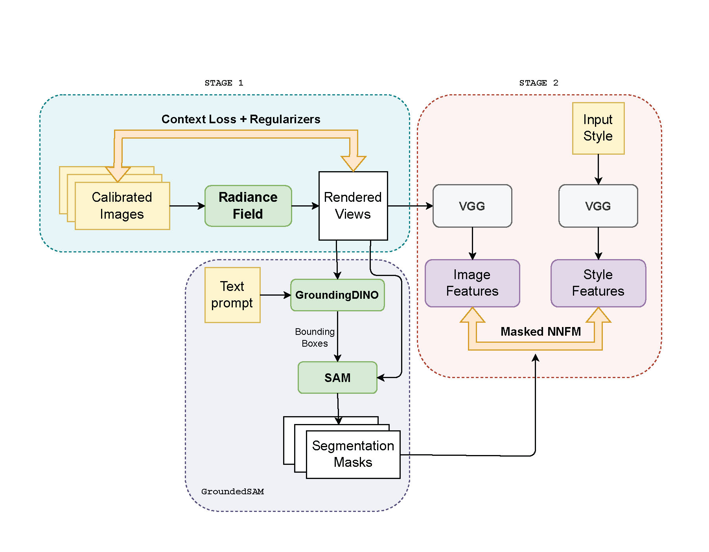

# Language-Driven-3D-Stylization

A language-guided 3D stylization method combined with ARF and GroundedSAM.

Install the GroundedSAM environment by following the instructions in [GroundedSAM](https://github.com/IDEA-Research/Grounded-Segment-Anything).

Then install the ARF environment by [ARF](https://github.com/Weijingmin2000/Language-Driven-3D-Stylization/blob/main/ARF_svox2_groundedsam/install.sh), and prepare the [data](https://github.com/Weijingmin2000/Language-Driven-3D-Stylization/blob/main/ARF_svox2_groundedsam/download_data.sh).

Run the following command to generate the stylized 3D scene:

```shell
cd ARF_svox2_groundedsam/opt
bash try_llff_groundedsam.sh
```

You could directly change the text prompt, style image, and scene name in the script.

